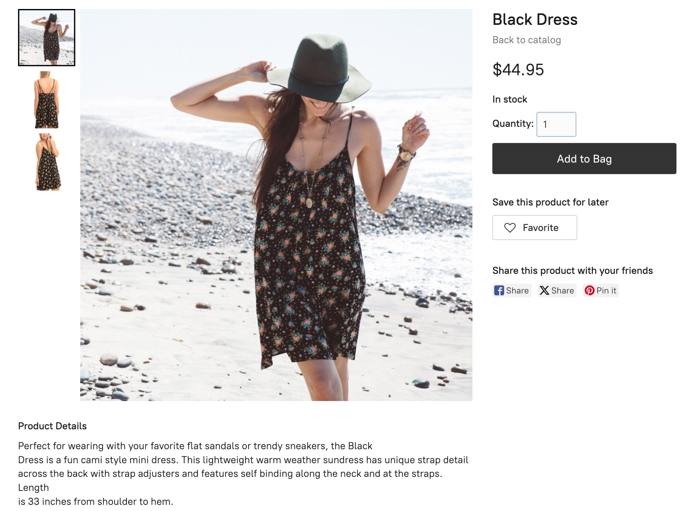
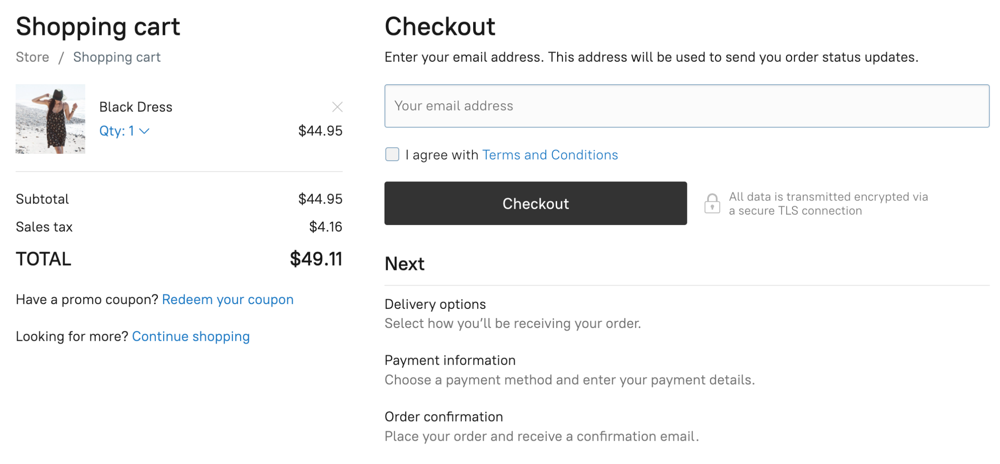

# Ecwid storefronts overview

**Ecwid storefront** is a fully functional store that can be used on any website. It allows customers to browse available products and buy them online through checkout.



<figure><figcaption></figcaption></figure>




<figure><figcaption></figcaption></figure>




Learn more about Ecwid Storefront in [Help Center](https://support.ecwid.com/hc/en-us/articles/207807915-Designing-your-Ecwid-storefront).

### Storefront customization

Ecwid storefront offers many [out-of-the-box](https://support.ecwid.com/hc/en-us/articles/207807915-Designing-your-Ecwid-storefront) design and configuration settings that affect product catalog, categories, and checkout. You can customize storefront design and functionality even further by applying custom scripts and configuration settings:

* **Customizing storefront with configuration settings**\
  \
  One way to customize a storefront is to apply Ecwid's built-in **configuration settings** – design settings available through Ecwid admin. Configs allow you to change the layouts, visibility, colors, fonts, and many other settings for different pages on the storefront. For example, you can set up specific product display options: hide attributes from the page, and change the layout of gallery images. You can also enable or disable specific features, such as checkout buttons, or social media sharing options.\
  \
  Configuration settings are typically easy to use even without deep coding knowledge. However, they are limited in terms of the customizations that you can make. If you want to make more extensive changes to your storefront, you may need to use custom JavaScript code.\

* **Customizing storefront with custom JavaScript code**\
  \
  Custom JavaScript code allows you to make more advanced customizations to your storefront. With JavaScript, you can add new features and widgets, modify store behavior, and change how the storefront interacts with customers. For example, you can add a custom promotions bar, enhance your product pages with dynamic effects, or even integrate third-party services like affiliate trackers.\
  \
  Using JS for storefront customization requires good coding knowledge, but gives you greater flexibility and control over the looks and functionality of your storefront.\
  \
  Ecwid also offers an extensive tool called **Ecwid JS API** that makes getting details about the store and customers much easier and allows automation of application logic with certain trigger events in the form of JS functions.

<table data-card-size="large" data-view="cards"><thead><tr><th></th><th data-type="content-ref"></th></tr></thead><tbody><tr><td><strong>Choose your way to storefront customization</strong></td><td><a href="get-started/storefront-customization-options.md">storefront-customization-options.md</a></td></tr><tr><td><strong>Use Ecwid tools in your project</strong></td><td><a href="get-started/quickstart-customize-storefront-with-ecwid-js-api.md">quickstart-customize-storefront-with-ecwid-js-api.md</a></td></tr></tbody></table>

