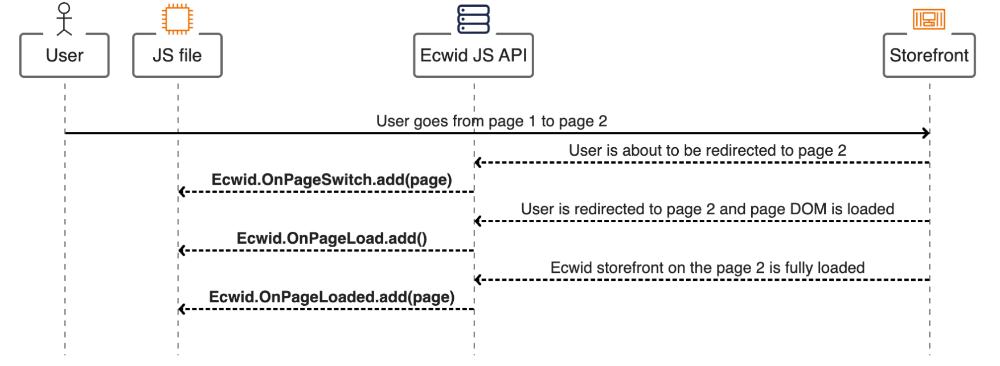

# "Page is loaded" events

These events notify you when the page switch is triggered, or the page gets partially or fully loaded:

<figure><figcaption></figcaption></figure>

### `Ecwid.OnPageSwitch`

This method allows tracking and preventing page switches on the storefront. It is triggered when a user is about to switch a page (a new page is not yet loaded).&#x20;

The method works synchronously and contains the `page` [argument](page-is-loaded-events.md#page-argument-field) in its callback function. Use it to identify the page where users go and prevent page loading by returning a `false` value.

Code example:

```javascript
Ecwid.OnPageSwitch.add(function(page) {
    if (page.type === "PRODUCT") {
        window.location.href = "index.html?type=product&id=" + page.productId
        return false
    } else if (page.type === "CATEGORY") {
        window.location.href = "index.html?type=category&id=" + page.categoryId
        return false
    }
})
```

### `Ecwid.OnPageLoad`

This event triggers instantly when the page DOM is loaded. This method doesn't wait for the Ecwid product browser and its contents to fully load and therefore doesn't return any details about the opened page.

Code example:

```javascript
Ecwid.OnPageLoad.add(function() {
    console.log("Page DOM has just loaded");
});
```

### `Ecwid.OnPageLoaded`

This method allows you to track the full page load – a moment when both DOM and product browser are loaded and ready for customization.

It contains a callback function with `page` [argument](page-is-loaded-events.md#page-argument-fields) containing information about a loaded page.

Code examples:



```javascript
Ecwid.OnPageLoaded.add(function(page){
  console.log(JSON.stringify(page));
});

// prints
// 
// {
//   "type":"PRODUCT",
//   "categoryId":0,
//   "hasPrevious":false,
//   "mainCategoryId":0,
//   "name":"Desk Black 101x50x76.5 cm Engineered Wood",
//   "nameTranslated":{
//     "cs":"",
//     "en":"Desk Black 101x50x76.5 cm Engineered Wood"
//   },
//   "productId":561386461
// }
```





<pre class="language-javascript"><code class="lang-javascript">Ecwid.OnPageLoaded.add(function(page){
  console.log(JSON.stringify(page));
});

// prints
// 
// {
//     "type": "SEARCH",
//     "filterParams": {
//         "attributes": {
//             "UPC": ["1003"],
//             "Brand": ["LEGO-LEGO"]
//         },
//         "categories": [172786255],
//         "includeProductsFromSubcategories": true,
<strong>//         "options": {
</strong>//             "Mark": ["I"]
//         }
//     },
//     "hasPrevious": true,
//     "offset": 0,
//     "sort": "relevance"
// }
```
</code></pre>



```javascript
Ecwid.OnPageLoaded.add(function(page) {
    if (page.type == "CART") {
      console.log(page);
  }
});

// prints
//
// {
//     "type": "CART",
//     "hasPrevious": false
// }
```





#### `page` argument fields:

<table><thead><tr><th width="182">Field</th><th width="154">Type</th><th>Description</th></tr></thead><tbody><tr><td>type</td><td>string</td><td>Storefront page type.<br><br>One of:<br><code>SIGN_IN</code> - Sign-in page for customers.<br><code>ACCOUNT_SETTINGS</code> - Main customer account page.<br><code>ORDERS</code> - Page where customers can see their order history.<br><code>ACCOUNT_SUBSCRIPTION</code> - Page where customers can see their subscription products.<br><code>ADDRESS_BOOK</code> - Page where customers can see their saved addresses page.<br><code>FAVORITES</code> - Page where customers can see products added to favorites.<br><code>RESET_PASSWORD</code> - Page where customers can reset their account password.<br><code>CATEGORY</code> - Any category page.<br><code>PRODUCT</code> - Any product page.<br><code>SEARCH</code> - Products search page.<br><code>CART</code> - First page of the checkout where customers can enter their email.<br><code>CHECKOUT_ADDRESS</code> - Checkout page where customers enter their address for delivery.<br><code>CHECKOUT_DELIVERY</code> - Checkout page where customers choose the shipping/pickup option.<br><code>CHECKOUT_ADDRESS_BOOK</code> - Checkout page where customers select one of the saved addresses.<br><code>CHECKOUT_PAYMENT_DETAILS</code> - Checkout page where customers select payment option<br><code>ORDER_CONFIRMATION</code> - Checkout page customers see after placing an order. Sometimes referred to as the "Thank you for order" page.<br><code>ORDER_FAILURE</code> - Page customers see in case of failed payment.<br><code>DOWNLOAD_ERROR</code> - Page customers see in case of failed file download (for digital products only).</td></tr><tr><td>name</td><td>string</td><td>Name of the currently opened category or product.<br><br>Available for <code>CATEGORY</code> and <code>PRODUCT</code> page types.</td></tr><tr><td>nameTranslated</td><td>object <a href="page-is-loaded-events.md#translations">translations</a></td><td>Available translations for the page name.</td></tr><tr><td>keywords</td><td>string</td><td><p>Keywords for searching orders on the customer account page or products on the product search page.<br></p><p>Available for <code>ORDERS</code>, and <code>SEARCH</code> page types.</p></td></tr><tr><td>offset</td><td>number</td><td><p>Offset for the current list of orders or products on the page starting from 0. <br></p><p>Available for <code>SEARCH</code>, and <code>CATEGORY</code> page types.</p></td></tr><tr><td>productId</td><td>number</td><td><p>Internal product ID. </p><p></p><p>Available for <code>PRODUCT</code> page type.</p></td></tr><tr><td>variationId</td><td>number</td><td><p>Internal product variation ID. </p><p></p><p>Available for <code>PRODUCT</code> page type.</p></td></tr><tr><td>categoryId</td><td>number</td><td><p>Internal category ID. Is <code>0</code> for the main store category. </p><p></p><p>Available for <code>CATEGORY</code> page type.</p></td></tr><tr><td>mainCategoryId</td><td>number</td><td><p>Default category ID for the product. <br></p><p>Available for <code>PRODUCT</code> page type.</p></td></tr><tr><td>orderId</td><td>string</td><td><p>ID of a placed order. </p><p></p><p>Available for <code>ORDER_CONFIRMATION</code> page type.</p></td></tr><tr><td>sort</td><td>string</td><td><p>Sorting order for products on the page. <br></p><p>One of:<br><code>normal</code> - Default product sorting from store settings.<br><code>relevance</code> - Most relevant to search criteria products first.<br><code>addedTimeDesc</code> - New products first.<br><code>priceAsc</code> - Sort products by price (from low to high).<br><code>priceDesc</code> - Sort products by price (from high to low).<br><code>nameAsc</code> - Sort products by name (from A to Z).<br><code>nameDesc</code> - Sort products by price (from Z to ).</p><p></p><p>Available for <code>SEARCH</code> and <code>CATEGORY</code> page types.</p></td></tr><tr><td>errorType</td><td>string</td><td><p>Type of error when digital product download has failed. </p><p></p><p>One of:<br><code>expired</code> - Download link expired.<br><code>invalid</code> - Download link is incorrect<br><code>limit</code> - Number of maximum allowed downloads for the link has been reached.</p><p></p><p>Available for <code>DOWNLOAD_ERROR</code> page type.</p></td></tr><tr><td>key</td><td>string</td><td><p>Internal product file ID. </p><p></p><p>Available for <code>DOWNLOAD_ERROR</code> page type.</p></td></tr><tr><td>filterParams</td><td>object <a href="page-is-loaded-events.md#filterparams">filterParams</a></td><td>Filter parameters used in a product search. Available for <code>SEARCH</code> and <code>CATEGORY</code> page types.</td></tr></tbody></table>

#### `filterParams`

<table><thead><tr><th width="210">Field</th><th width="138">Type</th><th>Description</th></tr></thead><tbody><tr><td>attributes</td><td>object attributes</td><td><p>List of selected attributes and their values for product search.<br><br>Format: object where each key is the attribute's name (string) and value is the list of selected values for that attribute (array of strings).</p><p></p><p>Check the <a href="page-is-loaded-events.md#search-page-details">code example</a> above. </p></td></tr><tr><td>options</td><td>object options</td><td><p>List of selected product options and their values for product search.</p><p></p><p>Format: object where each key is the option's name (string) and value is the list of selected values for that option (array of strings).</p><p></p><p>Check the <a href="page-is-loaded-events.md#search-page-details">code example</a> above. </p></td></tr><tr><td>categories</td><td>array of numbers</td><td><p>List of selected category IDs for product search.</p><p></p><p>Check the <a href="page-is-loaded-events.md#search-page-details">code example</a> above. </p></td></tr><tr><td>includeProductsFromSubcategories</td><td>boolean</td><td>Defines if the search includes products from subcategories of selected categories. <br><br>One of:<br><code>true</code> - Search includes subcategories.<br><code>false</code> - Search doesn't include subcategories.</td></tr><tr><td>keyword</td><td>string</td><td><p>Currently applied keyword for searching products on the category or product search pages.<br></p><p>Available for <code>CATEGORY</code>, and <code>SEARCH</code> page types.</p></td></tr><tr><td>inventory</td><td>number</td><td><p>Defines if the search includes only products "in stock" (with stock more than 0). </p><p><br>One of:<br><code>instock</code> - Search includes only "in stock" products.<br><code>""</code> - Search also includes "out of stock" products.</p></td></tr><tr><td>hasPrevious</td><td>number</td><td><p>Defines if a customer had already visited other store pages before this one. </p><p><br>One of:<br><code>true</code> - This is not an entry page.<br><code>false</code> This is an entry page for the customer.</p></td></tr></tbody></table>

#### translations

Object with text field translations in the `"lang": "text"` format, where the `"lang"` is an ISO 639-1 language code. For example:

```
{
    "en": "Sample text",
    "nl": "Voorbeeldtekst"
}
```

Translations are available for all active store languages. Only the default language translations are returned if no other translations are provided for the field. Find active store languages with <mark style="color:green;">`GET`</mark> `/profile` request > `languages` > `enabledLanguages`.
